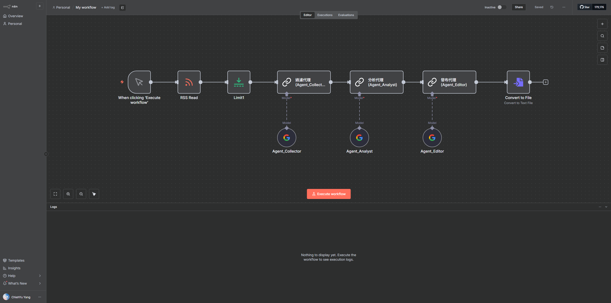

##### 基於多代理系統的自動化科技趨勢分析平台 (n8n AI Analysis)

這是一個基於 n8n 與 Google Gemini API 開發的自動化情報工具。它能自動監測科技媒體的 RSS 訂閱源，並透過三個 AI 代理人（Agents）進行篩選與深度分析，最後產出精鍊的 Markdown 科技週報。

###### 核心技術與亮點

多代理協作： 模仿真實工作流程，將任務拆解為「蒐集員」、「分析師」與「總編輯」，各司其職確保資訊品質。

精準過濾機制： 內建二元分類邏輯，能自動排除雜訊，只針對 AI、資安、雲端等技術主題進行深入剖析。

零接觸自動化： 從資料抓取到最後生成 .md 檔案完全自動化，將 5 分鐘的人工閱讀過程壓縮至 10 秒內完成。

視覺化流水線： 採用 n8n 低代碼介面開發，資料流向透明，方便隨時調整分析邏輯或擴充資料來源。

###### 環境與帳號需求

本專案為 n8n 工作流檔案，需具備以下環境：

n8n (桌面版或雲端版皆可)

Google Gemini API Key (可至 Google AI Studio 免費申請)

###### 如何安裝與執行

下載專案：

將本專案的 News.json 工作流檔案下載至本機。

匯入 n8n：

開啟 n8n 介面，選擇「Import from File」並選取該 JSON 檔案。

設定 API Key：

在 n8n 的 Credentials 頁面新增 Google Gemini(PaLM) Api 並填入你的 API Key。

###### 使用說明

點擊左下角的 Execute Workflow 啟動自動化流程。

系統會自動從 iThome 等來源抓取最新新聞，並依照「過濾 -> 分析 -> 排版」的順序執行。

執行完成後，在最後一個 Convert to File 節點即可下載產出的 Report.md 深度報告。

